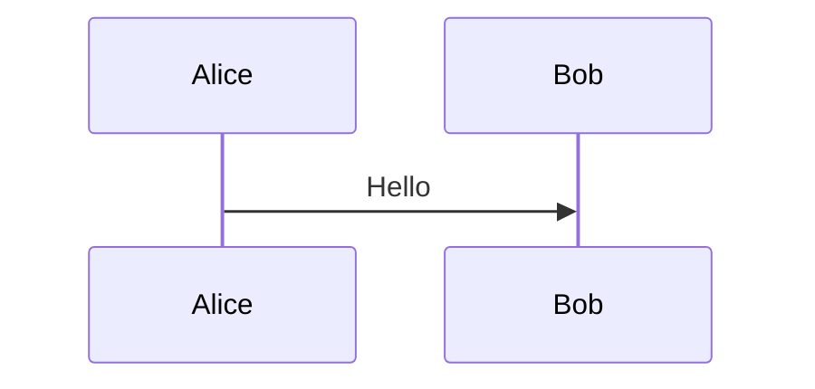

# Mermaid

## 基本

````md

````

## 共通設定
- ルートの `mermaid.config.ts` を基準設定として利用
- 各デッキの `setup/mermaid.ts` で `mermaid.config.ts` を読み込む

````ts
import { defineMermaidSetup } from '@slidev/types'
import baseConfig from '../../../mermaid.config.ts'

export default defineMermaidSetup(() => baseConfig)
````

## デッキ単位の上書き
- `setup/mermaid.ts` で `baseConfig` に上書きを追加
- 例: `themeVariables` の色だけ変更

## deck.yml にメモとして持たせる
- デッキ固有のMermaid設定を `deck.yml` に記録
- 実際の反映は `setup/mermaid.ts` に反映して同期する
